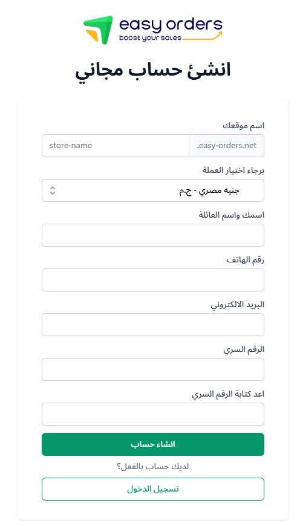

# إنشاء حساب جديد

مرحبًا بك في **Easy Orders**! في هذه الصفحة، يمكنك إنشاء حساب جديد بسهولة والبدء في استخدام المنصة لإنشاء متجرك الإلكتروني.

### خطوات التسجيل

1. **اسم المتجر**:
   - أدخل اسم المتجر الذي ترغب في استخدامه. في حال لم يكن لديك **دومين جاهز**، يجب التأكد أن اسم المتجر لم يتم استخدامه من قبل شخص آخر.
   - يمكنك دائمًا **ربط دومين خاص بك بعد تسجيل الدخول** من لوحة التحكم.

2. **اختيار العملة**:
   - اختر العملة التي ستعمل بها في متجرك. يمكنك اختيار **جنيه مصري** أو أي عملة أخرى حسب احتياجاتك.

3. **البيانات الشخصية**:
   - أدخل بياناتك الشخصية مثل: الاسم، رقم الهاتف، البريد الإلكتروني، الرقم السري.
   - تأكد من استخدام رقم سري قوي من أجل حماية حسابك.

4. **إنشاء الحساب**:
   - بعد إدخال جميع البيانات المطلوبة، اضغط على **إنشاء حساب** لتكملة العملية.

### ملاحظات

- بعد التسجيل، يمكنك الدخول إلى لوحة التحكم الخاصة بك.
- في حال كنت ترغب في **ربط دومين خاص بك**، يمكنك فعل ذلك بسهولة من خلال لوحة التحكم بعد تسجيل الدخول.

### رابط الصفحة

يمكنك الوصول إلى صفحة التسجيل عبر الرابط التالي:  
[إنشاء حساب جديد في Easy Orders](https://www.easy-orders.net/register/)

### الصورة التوضيحية

إليك صورة توضح كيفية ملء بيانات التسجيل:

