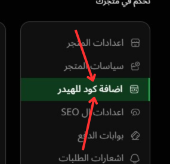

# اضافة كود للهيدر

---

### الصورة التوضيحية

إليك صورة توضح طريقه طريقه الوصول اليها:

في هذه الصفحة، يمكنك إضافة **كود مخصص** إلى الهيدر الخاص بموقعك، سواء كان **HTML** أو **JavaScript** أو **CSS**. يمكن استخدام هذه الإضافة لتحسين الوظائف أو إضافة أدوات تخصيص لموقعك.

### 1. **إضافة أكواد مخصصة**

- **تخصيص الهيدر**:
  يمكنك إضافة **أكواد مخصصة** لجزء الهيدر لموقعك. مثلًا:
  - **أكواد HTML**: يمكن استخدامها لإضافة عناصر ثابتة أو روابط مخصصة تظهر في أعلى الصفحات.
  - **أكواد JavaScript**: يمكن استخدام هذه الأكواد لتضمين أدوات خارجية أو إضافة تفاعلات مخصصة في الهيدر.
  - **أكواد CSS**: يمكنك تضمين أكواد **CSS** لتخصيص تصميم الهيدر بما يتناسب مع هوية متجرك، مثل تغيير الألوان أو الخطوط.

### 2. **إدخال الكود**

- **نص الكود**:
  في الجزء المخصص لإدخال الكود، يمكنك إدخال **أي كود HTML أو JavaScript أو CSS** حسب احتياجك.
  - **HTML**: إضافة أكواد مثل **إعلانات، روابط، أزرار**.
  - **JavaScript**: تضمين أكواد مثل **تحليلات جوجل** أو **إضافات خارجية**.
  - **CSS**: إضافة تنسيقات مخصصة مثل **أبعاد، ألوان، تأثيرات على الهيدر**.

- **التعليمات**:
  - إذا أردت إضافة كود **HTML**، يمكنك وضعه مباشرة في المكان المخصص لذلك.
  - إذا أردت إضافة كود **JavaScript** أو **CSS**، يتم تضمينه داخل **علامات `<script>`** أو **`<style>`** على التوالي.

### 3. **ملاحظة هامة**

- **ملحوظة**: لا تقم بإضافة **كود جوجل أناليتكس** أو **جوجل تاج مانجر** هنا. بدلاً من ذلك، قم بإضافتهم في الأدوات المخصصة لهم في **جزء ربط منصات أخرى**.

### 4. **حفظ التغييرات**

- بعد إضافة الكود المخصص، تأكد من **حفظ التغييرات** لضمان تطبيق الكود في الهيدر.
