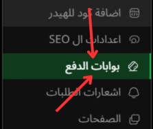

# وسائل الدفع

---

## الصورة التوضيحية

إليك صورة توضح طريقه طريقه الوصول اليها:

في هذه الصفحة، يمكنك التحكم في **وسائل الدفع** المتاحة لمتجرك. هذه الخيارات تتيح لك تفعيل أو تعطيل وسائل الدفع المختلفة التي يمكن للعملاء استخدامها عند شراء المنتجات من متجرك الإلكتروني.

### 1. **تفعيل/تعطيل وسائل الدفع**

يمكنك تحديد **الوسائل التي ستتيحها لعملائك**:

- **تفعيل**: يمكنك تفعيل وسائل الدفع من خلال الضغط على زر **تفعيل** بجانب كل وسيلة دفع.
- **تعطيل**: إذا كنت ترغب في تعطيل وسيلة دفع معينة، اضغط على زر **مفعل** لجعلها غير فعالة.

### 2. **الوسائل المتاحة**

إليك قائمة بالوسائل المتاحة التي يمكنك تفعيلها أو تعطيلها على المتجر:

1. **COD (الدفع عند الاستلام)**
2. **Paymob**
3. **Kashier**
4. **Stripe**
5. **PayPal**
6. **PayTabs**
7. **Moyasar**
8. **Paylink**
9. **Tap**
10. **Tabby**
11. **Taager**
12. **MyFatoorah**
13. **Fawaterk**
14. **XPay**
15. **Ziina**

### 3. **كيفية التحكم في وسائل الدفع**

- في الصورة، سترى مجموعة من الأيقونات الخاصة بكل وسيلة دفع.
- لكل وسيلة دفع، يمكنك **تفعيلها أو تعديلها** حسب الحاجة.
- عند تفعيل وسيلة دفع، سيتاح للعملاء استخدامها أثناء عملية الشراء.
  
  - **الزر الأخضر "تفعيل"** يعني أنه يمكن للعملاء استخدام الوسيلة المحددة في متجرك.
  - **الزر الرمادي "مفعل"** يعني أنه تم تعطيل الوسيلة.

### الشرح التفصيلي

1. **تفعيل/تعطيل وسائل الدفع**:
   - تتيح لك هذه الصفحة تمكين أو تعطيل وسائل الدفع بناءً على احتياجاتك.
   - يمكنك إضافة العديد من الوسائل لتوفير خيارات متعددة للعملاء.

2. **وسائل الدفع المتاحة**:
   - تشمل الوسائل الشائعة مثل **PayPal** و **Stripe**، بالإضافة إلى وسائل محلية مثل **Paymob** و **MyFatoorah**.
   - يمكنك اختيار الوسائل التي تناسب نوع عملائك ومنطقتك الجغرافية.

3. **التحكم الكامل**:
   - بعد تفعيل الوسائل، يمكنك بسهولة إيقاف أو تشغيل أي منها حسب الحاجة.
   - يمكن تعديل الوسائل في أي وقت من هذه الصفحة لتوفير أقصى قدر من الراحة للعملاء.
