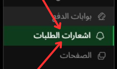

# اشعارات الطلبات

---

## الصورة التوضيحية

إليك صورة توضح طريقه طريقه الوصول اليها:

تسمح لك صفحة "إشعارات الطلبات" بتفعيل أو تعطيل الإشعارات التي تصلك عند تقديم طلبات جديدة عبر المتجر. هذه الإشعارات تتيح لك متابعة الطلبات بشكل أفضل، مما يسهل إدارة عملك.

### 1. **تمكين الإشعارات**

- لإرسال إشعارات عند تقديم طلب جديد، يجب عليك تفعيل خيار "تفعيل الإشعارات لهذا الجهاز".
- بعد تفعيل الإشعارات، ستتلقى إشعارًا فوريًا عندما يتم تقديم طلب جديد على متجرك.
- هذا الخيار يمكن أن يعمل عبر التطبيق أو عبر الموقع الإلكتروني.
  
### 2. **السماح بالتنبيهات**

- في حال كنت تستخدم **التطبيق** أو **الموقع**، يجب السماح لهما **بتلقي الإشعارات** من خلال **إعدادات المتصفح أو إعدادات التطبيق**.
- هذا يضمن أنك ستتلقى إشعارات فورية عند تقديم طلبات جديدة على المتجر.

### 3. **حفظ التغييرات**

- بعد تمكين هذه الإعدادات، يجب عليك النقر على زر **"حفظ"** لتطبيق التغييرات.

### 4. **التحكم في الإشعارات**

- بمجرد تفعيل الإشعارات، يمكنك التحكم في إرسال التنبيهات على جهازك الشخصي.
- إذا لم ترغب في تلقي الإشعارات في أي وقت، يمكنك إيقاف هذه الميزة باستخدام نفس الإعدادات.

---

### الخلاصة

تساعد هذه الصفحة في إبقاء المستخدم على اطلاع دائم بكل طلب يتم تقديمه في المتجر من خلال إشعارات فورية. وهذا يساعد في تحسين تجربة المستخدم وتعزيز سرعة استجابة أصحاب المتاجر لإتمام الطلبات.
