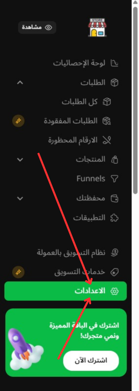
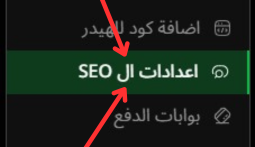

# اعدادت ال SEO

---

### الصورة التوضيحية

إليك صورة توضح طريقه طريقه الوصول اليها:

تتيح لك هذه الصفحة تخصيص إعدادات **SEO (تحسين محركات البحث)** لمتجرك على **Easy Orders**. من خلال هذه الإعدادات، يمكنك تحسين ظهور متجرك في محركات البحث مثل **جوجل** لزيادة الظهور وجذب الزوار.

### 1. **عنوان الموقع الرئيسي**

- في هذا القسم، يمكنك إدخال **عنوان الموقع الرئيسي** لمتجرك. هذا العنوان يظهر في محركات البحث ويُعد مهمًا لتحسين الـ SEO. يتم إدخال عنوان مختصر وجذاب يمكن أن يساعد الزوار في معرفة محتوى المتجر.
  
  - **مثال**: في الصورة، يتم إدخال "M-A-M" كعنوان الموقع الرئيسي، ويمكنك تخصيصه بما يتناسب مع اسم متجرك.

### 2. **وصف الميتا (Meta Description)**

- **وصف الميتا** هو وصف مختصر يظهر في نتائج محركات البحث تحت عنوان الموقع. هذا الوصف هو ما يراه الزوار في نتائج البحث عند بحثهم عن متجرك.
  
  - **ملاحظة**: يفضل أن يكون الوصف جذابًا وواضحًا ويشمل الكلمات الرئيسية التي ترغب في تصدرها في نتائج البحث. قم بوصف خدماتك أو المنتجات التي تقدمها بشكل مختصر.

### 3. **شعار المتجر**

- **تحميل شعار المتجر**: يمكنك رفع **شعار المتجر** الخاص بك ليظهر في محركات البحث وفي الجزء العلوي من المتجر.
  
  - **ملاحظة**: يجب أن يكون الشعار بتنسيق مناسب، ويعكس هوية متجرك. في الصورة، يوجد خيار لتغيير الصورة أو رفع صورة جديدة.

### 4. **الأيقونة المصغرة 16x16**

- **تحميل الأيقونة المصغرة (Favicon)**: في هذا الحقل، يمكنك رفع **الأيقونة المصغرة** لمتجرك. هذه الأيقونة تظهر في التبويبات الخاصة بالمتصفح عندما يزور الزوار متجرك.

  - **ملاحظة**: تأكد من أن الأيقونة المصغرة تكون واضحة وجذابة، ويمكنك استخدامها أيضًا كأيقونة للتطبيق في المستقبل.

### 5. **حفظ التغييرات**

- بعد إتمام التعديلات على **عنوان الموقع الرئيسي**، **وصف الميتا**، **شعار المتجر**، و **الأيقونة المصغرة**، تأكد من الضغط على **حفظ** لتطبيق التغييرات.
