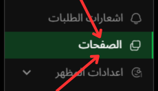

# اضافه صفحات لمتجرك

يمكنك الوصول إلى صفحة إعدادات الصفحات عبر الرابط التالي: [الصفحات](https://app.easy-orders.net/#/simple-pages)

---

## الصورة التوضيحية

إليك صورة توضح طريقة الوصول إلى هذه الصفحة:

يمكنك إضافة وتحديد الصفحات التي تظهر في الهيدر أو إخفائها من الموقع عبر هذه الصفحة. هذه الصفحات تعتبر من الأمور المهمة لزيادة الثقة بين عملائك مثل سياسة الخصوصية، سياسة الاسترجاع، شروط الاستخدام وغيرها.

---

### 1. **إعدادات الصفحة**

- **العنوان**: يمكنك تخصيص عنوان كل صفحة حسب احتياجك.
- **الروابط**: يمكنك إضافة الروابط الخاصة بكل صفحة لضمان الوصول إليها بشكل مباشر.
- **هل الصفحة نشطة؟**: من هنا يمكنك تحديد إذا كانت الصفحة نشطة أم لا.
- **تظهر في الهيدر**: إذا كنت ترغب في أن تظهر هذه الصفحة في الهيدر، يمكنك تفعيل هذه الخيار.

### 2. **إضافة صفحات جديدة**

- لإضافة صفحات جديدة مثل سياسة الخصوصية، شروط الاستخدام، سياسة الشحن، وغيرها، يمكنك النقر على زر "إنشاء" لإنشاء صفحة جديدة وإضافة المحتوى الذي تريده.
  
### 3. **إدارة الصفحات الحالية**

- ستظهر لك جميع الصفحات التي تم إنشاؤها في هذه الصفحة، مع إمكانية تعديل أو إيقاف الصفحات الحالية.
