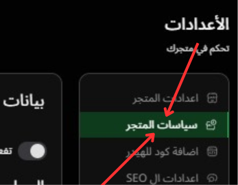

# بيانات و سياسات المتجر

---

### الصورة التوضيحية

إليك صورة توضح طريقه طريقه الوصول اليها:

في هذه الصفحة، يمكنك إعداد **بيانات متجرك** وضبط **السياسات المختلفة** التي تحدد طريقة التعامل مع الطلبات، الشحن، الدفع، الاسترجاع، وغيرها من سياسات المتجر الأساسية. هذه الإعدادات ضرورية لضمان تجربة مستخدم سلسة واحترافية.

### 1. **بيانات المتجر الأساسية**

- **البريد الإلكتروني للمتجر**:
  - يجب إدخال البريد الإلكتروني الذي سيتم التواصل من خلاله مع العملاء، حيث سيظهر في فواتير الطلبات والتنبيهات.
  
- **رقم الهاتف للمتجر**:
  - أدخل رقم هاتف للتواصل مع العملاء في حال الحاجة.
  
- **عنوان الشركة**:
  - أدخل العنوان الفعلي للشركة. يجب أن يكون العنوان دقيقًا لاستخدامه في الفواتير والشحن.
  
### 2. **إعدادات سياسة الشحن**

- **سياسة الشحن**:
  - في هذا القسم، يمكنك تحديد سياسة الشحن الخاصة بمتجرك.
  - على سبيل المثال، يمكنك تحديد ما إذا كان الشحن مجانيًا في حالات معينة أو وضع تسعير معين للشحن.
  - **محتوى السياسة**: يمكنك إضافة النصوص الخاصة بسياسة الشحن مثل "الشحن مجاني للطلبات التي تتجاوز مبلغ معين" أو "الشحن يكون خلال 3-5 أيام عمل".

### 3. **سياسة الدفع عند الاستلام**

- **تفعيل سياسة الدفع عند الاستلام**:
  - يمكنك تفعيل أو تعطيل خيار الدفع عند الاستلام بناءً على سياسة متجرك.
  - بعد تفعيل هذه الخاصية، ستتمكن من تحديد **سياسة الدفع عند الاستلام** لعملائك، سواء كان سيتم فرض رسوم إضافية أو لا.

- **عنوان سياسة الدفع عند الاستلام**:
  - يتم تخصيص عنوان خاص لسياسة الدفع عند الاستلام والذي سيظهر للعملاء عند اختيارهم لهذا الخيار.
  - **محتوى السياسة**: هنا يمكنك إضافة تفاصيل حول سياسة الدفع عند الاستلام مثل كيفية التعامل مع العملاء الذين يختارون هذا الخيار.

### 4. **سياسة الاسترجاع**

- **عنوان سياسة الاسترجاع**:
  - في هذا الحقل، يمكنك إدخال العنوان المناسب لسياسة الاسترجاع.
  
- **محتوى سياسة الاسترجاع**:
  - يمكنك إضافة التفاصيل المتعلقة بسياسة الاسترجاع مثل المدة المحددة التي يمكن فيها للعملاء إرجاع المنتجات، والشروط التي يجب أن يستوفيها المنتج للإرجاع.

### 5. **حفظ التغييرات**

- بعد تعديل جميع السياسات والبيانات، لا تنسى الضغط على **حفظ** لتطبيق التغييرات التي أجريتها.
