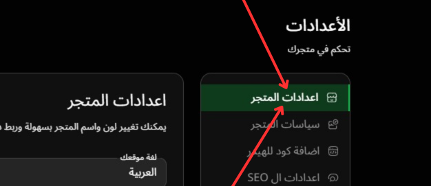

# إعدادات المتجر

---

### الصورة التوضيحية

إليك صورة توضح طريقه طريقه الوصول اليها:

في هذه الصفحة، يمكنك تخصيص إعدادات متجرك الإلكتروني بكل سهولة. من تغيير اسم المتجر إلى ربط الدومين الخاص بك، بالإضافة إلى إعدادات العملة والشحن والمزيد.

### 1. **اللغة المفضلة للمتجر**

- **اختيار اللغة**: في هذا الخيار، يمكنك تحديد **اللغة المفضلة** لمتجرك. في المثال الموجود، تم تحديد اللغة **العربية** من خلال القائمة المنسدلة.
  
  - **كيفية التغيير**: يمكنك تغيير اللغة إلى أي لغة مدعومة وفقًا لاحتياجاتك. سيؤثر هذا على جميع النصوص والعناصر في المتجر بما يتناسب مع اللغة المحددة.

### 2. **اسم المتجر وعنوان الموقع**

- **اسم المتجر**: في هذا الخيار، يمكنك إدخال **اسم المتجر** الذي سيظهر على الموقع.
  
  - **ملاحظة**: إذا لم يكن لديك **دومين جاهز**، يجب أن تتأكد من أن اسم المتجر الذي اخترته غير مستخدم من قبل. بعد تسجيل الدخول، يمكنك ربط **دومين خاص** بك من لوحة التحكم.
  
- **عنوان الموقع الرئيسي**: هذا هو العنوان الذي يظهر عند زيارة المتجر عبر الإنترنت. يتم إدخال عنوان رئيسي. يُفضل استخدام عنوان بسيط ومميز.

### 3. **إعدادات الدومين**

- في هذا القسم، يمكن ربط **دومين خاص** بالمتجر بعد التسجيل. إذا كنت لا ترغب في استخدام النطاق الفرعي **easy-orders.net**، يمكنك ربط **دومين مخصص** لمتجرك.

### 4. **إعدادات الهيدر**

- **الجزء العلوي من الهيدر**: في هذا القسم، يمكنك إضافة **محتوى خاص** يظهر في الجزء العلوي من **الهيدر** (مثل العروض الخاصة أو التنبيهات المهمة).

  - **إعدادات الجزء العلوي**: يمكنك تخصيص هذا الجزء لعرض رسائل خاصة لزوار متجرك، مثل العروض الترويجية أو رسائل الترحيب.

### 5. **اللون والمظهر**

- **لون الموقع**: يمكنك تحديد **اللون الرئيسي** للمتجر من خلال إدخال الكود اللوني في الحقل المناسب (مثل `#000000`). هذا سيغير **تصميم المتجر** ليتناسب مع الهوية البصرية الخاصة بك.

- **لون الرأس**: يمكنك أيضًا تخصيص **لون الرأس** من خلال إدخال اللون المناسب.

### 6. **شعار المتجر**

- في هذا القسم، يمكنك تحميل **شعار المتجر** الخاص بك الذي سيظهر في أعلى الموقع.

  - **الرفع والتغيير**: يمكنك رفع صورة الشعار من جهازك أو تغيير الصورة الحالية. تأكد من أن الشعار يعكس هوية متجرك بشكل جيد.

### 7. **الأيقونة المصغرة**

- **الأيقونة المصغرة 16x16**: هنا يمكنك تحميل **أيقونة صغيرة** للمتجر ستكون مرئية في التبويب الخاص بالمتصفح.

### 8. **إعدادات الشحن**

- **سعر الشحن**: يمكنك تحديد **سعر الشحن** الذي سيتم تطبيقه على الطلبات بشكل عام لمتجرك هنا . يمكنك أيضًا تحديد القيمه ب 0 (صفر) إذا كان **الشحن مجانيًا** (ملحوظه يوجد تحكم اكبر في سعر الشحن في قسم اخر في الاعدادات سيتم التحدث عنه لاحقا)

  - **الشحن المجاني**:تحديد القيمه ب 0 (صفر)

### 9. **إعدادات الخط**

- **اختيار الخط**: يمكنك تحديد الخط الذي ترغب في استخدامه في متجرك. بشكل افتراضي، تم اختيار **خط "Almarai"**.

  - **ملاحظة**: يفضل اختيار خطوط واضحة وسهلة القراءة لضمان تجربة مستخدم جيدة.

### 10. **العملة**

- **العملة المستخدمة**: يمكنك تحديد العملة التي سيتم استخدامها في المتجر. بشكل افتراضي، يتم تحديد **الجنيه المصري (ج.م)**.

  - **ملاحظة**: يجب اختيار العملة التي تناسب جمهورك المستهدف وتتناسب مع النظام المالي للمتجر.

### 11. **الدولة والمنطقة الزمنية**

- **اختيار الدولة**: في هذا الحقل، اختر الدولة التي يتم فيها تشغيل المتجر.

- **المنطقة الزمنية**: اختر المنطقة الزمنية الخاصة بموقعك لتحديد توقيت العمليات مثل الشحن أو التحديثات.

### 12. **إيقاف  الاختيار التلقائي لمناطق الشحن. أو المتغيرات**

- **إيقاف  الاختيار التلقائي لمناطق الشحن.**: يمكنك تعطيل  الاختيار التلقائي لمناطق الشحن. الجغرافية الخاصة بالشحن.
  
- **إيقاف  الاختيار التلقائي للمتغيرات**: يمكنك أيضًا تعطيل  الاختيار التلقائي للمتغيرات الخاصة بالمنتجات مثل اللون أو الحجم.

### 13. **حفظ التغييرات**

- في نهاية الصفحة، لا تنسَ **حفظ التغييرات** التي أجريتها لضمان تطبيق جميع التعديلات على المتجر.
